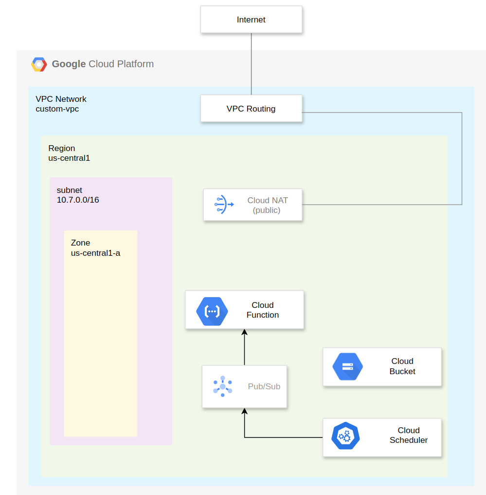

<!-- BEGIN_TF_DOCS -->
## Requirements

| Name | Version |
|------|---------|
|  [google](#requirement\_google) | 5.29.1 |

## Function Deployed

[Github Repo](https://github.com/mdmourao/menu-bot)  

## Deployed Infrastructure

## Providers

No providers.

## Modules

| Name | Source | Version |
|------|--------|---------|
|  [cloud\_bucket](#module\_cloud\_bucket) | ./modules/cloud_bucket | n/a |
|  [cloud\_function](#module\_cloud\_function) | ./modules/cloud_function | n/a |
|  [cloud\_pubsub](#module\_cloud\_pubsub) | ./modules/cloud_pubsub | n/a |
|  [cloud\_scheduler](#module\_cloud\_scheduler) | ./modules/cloud_scheduler | n/a |

## Resources

No resources.

## Inputs

| Name | Description | Type | Default | Required |
|------|-------------|------|---------|:--------:|
|  [bucket\_region](#input\_bucket\_region) | Bucket region | `string` | n/a | yes |
|  [menu\_source\_code\_path](#input\_menu\_source\_code\_path) | Menu Zip Source Code Path | `string` | n/a | yes |
|  [project\_name](#input\_project\_name) | Name of the project | `string` | n/a | yes |
|  [project\_number](#input\_project\_number) | Project Number | `number` | n/a | yes |
|  [region](#input\_region) | Deploy region | `string` | `"us-central1"` | no |
|  [zone](#input\_zone) | Deploy Zone | `string` | `"us-central1-a"` | no |

## Outputs

No outputs.
<!-- END_TF_DOCS -->